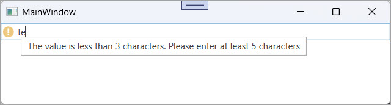

<!-- default badges list -->

[](https://supportcenter.devexpress.com/ticket/details/E3459)
[](https://docs.devexpress.com/GeneralInformation/403183)
[](#does-this-example-address-your-development-requirementsobjectives)
<!-- default badges end -->

# WPF Editors - Indicate Errors and Warnings by Implementing IDataErrorInfo

This example validates the input field and displays error indicators in DevExpress editors. The solution implements the standard `IDataErrorInfo` interface and uses a custom `ErrorControl` style to display different icons and messages for errors, warnings, and informational notes.

Users can see visual indicators (error, warning, information) directly in the editor. Each indicator includes a descriptive message that helps users quickly fix input mistakes.



## Implementation Details

### Create Validation Logic

The data object implements the `IDataErrorInfo` interface. The `Error` property returns a formatted string that includes the error type and message:

```csharp
public class TestClass : IDataErrorInfo {
    public string TestString { get; set; }

    string IDataErrorInfo.Error {
        get { return GetError(); }
    }

    string GetError() {
        if (string.IsNullOrEmpty(TestString))
            return "ErrorType=Critical;ErrorContent=The value is not provided. Please enter a value";
        if (TestString.Length < 3)
            return "ErrorType=Warning;ErrorContent=The value is less than 3 characters. Please enter at least 5 characters";
        if (TestString.Length < 5)
            return "ErrorType=Information;ErrorContent=The value is less than 5 characters. Please enter at least 5 characters";
        return string.Empty;
    }

    string IDataErrorInfo.this[string columnName] {
        get {
            if (columnName == "TestString")
                return GetError();
            return string.Empty;
        }
    }
}
```

### Parse Error Content

The error string encodes multiple values (`ErrorType` and `ErrorContent`). A value converter extracts the required part of the string that displays it in the UI:

```csharp
public class ErrorContentConverter : IValueConverter {
    public string GetValueTag { get; set; }
    public string Separator { get; set; }

    public object Convert(object value, Type targetType, object parameter, System.Globalization.CultureInfo culture) {
        if (value == null || !(value is string))
            return value;
        string error = System.Convert.ToString(value, culture);
        if (string.IsNullOrEmpty(error))
            return value;

        string searchString = GetValueTag + "=";
        foreach (string suberror in error.Split(new string[] { Separator }, StringSplitOptions.RemoveEmptyEntries)) {
            if (suberror.Contains(searchString))
                return suberror.Replace(searchString, string.Empty);
        }
        return value;
    }
    public object ConvertBack(object value, Type targetType, object parameter, System.Globalization.CultureInfo culture) {
        return null;
    }
}
```

### Apply Two Converter Modes

The converter works in **Type** and **Content** modes. You can extract the `ErrorType` or the `ErrorContent` from the `IDataErrorInfo.Error` string:

* **Type** mode drives an implicit `ErrorControl` style that picks the appropriate icon (Critical/Warning/Information).
* **Content** mode feeds a custom tooltip that displays the error message next to the editor.

```xaml
<Window.Resources>
    <ResourceDictionary>
        <local:ErrorContentConverter x:Key="ErrorContentToErrorTypeConverter" GetValueTag="ErrorType" Separator=";"/>
        <local:ErrorContentConverter x:Key="ErrorContentConverter" GetValueTag="ErrorContent" Separator=";"/>

        <Style TargetType="{x:Type dxe:ErrorControl}" BasedOn="{StaticResource {x:Type dxe:ErrorControl}}">
            <Style.Triggers>
                <DataTrigger Binding="{Binding Path=Content.ErrorContent, RelativeSource={RelativeSource Self}, Converter={StaticResource ErrorContentToErrorTypeConverter}}" Value="Critical">
                    <Setter Property="ContentTemplate" Value="{DynamicResource {dxet:ErrorTypesThemeKeyExtension ResourceKey=Critical}}" />
                </DataTrigger>
                <DataTrigger Binding="{Binding Path=Content.ErrorContent, RelativeSource={RelativeSource Self}, Converter={StaticResource ErrorContentToErrorTypeConverter}}" Value="Warning">
                    <Setter Property="ContentTemplate" Value="{DynamicResource {dxet:ErrorTypesThemeKeyExtension ResourceKey=Warning}}" />
                </DataTrigger>
                <DataTrigger Binding="{Binding Path=Content.ErrorContent, RelativeSource={RelativeSource Self}, Converter={StaticResource ErrorContentToErrorTypeConverter}}" Value="Information">
                    <Setter Property="ContentTemplate" Value="{DynamicResource {dxet:ErrorTypesThemeKeyExtension ResourceKey=Information}}" />
                </DataTrigger>
            </Style.Triggers>
        </Style>
    </ResourceDictionary>
</Window.Resources>

<StackPanel>
    <dxe:TextEdit EditValue="{Binding Path=TestString, ValidatesOnDataErrors=True, UpdateSourceTrigger=PropertyChanged}">
        <dxe:TextEdit.ErrorToolTipContentTemplate>
            <DataTemplate>
                <TextBlock Text="{Binding Path=ErrorContent, Converter={StaticResource ErrorContentConverter}}" />
            </DataTemplate>
        </dxe:TextEdit.ErrorToolTipContentTemplate>
    </dxe:TextEdit>
</StackPanel>
```

## Files to Review

* [MainWindow.xaml](./CS/MainWindow.xaml) (VB: [MainWindow.xaml](./VB/MainWindow.xaml))
* [MainWindow.xaml.cs](./CS/MainWindow.xaml.cs) (VB: [MainWindow.xaml.vb](./VB/MainWindow.xaml.vb))

## Documentation

* [TextEdit](https://docs.devexpress.com/WPF/DevExpress.Xpf.Editors.TextEdit)
* [EditValue](https://docs.devexpress.com/WPF/DevExpress.Xpf.Editors.BaseEdit.EditValue)
* [ErrorToolTipContentTemplate](https://docs.devexpress.com/WPF/DevExpress.Xpf.Editors.BaseEdit.ErrorToolTipContentTemplate)
* [ErrorContent](https://docs.devexpress.com/WPF/DevExpress.Xpf.Editors.Validation.BaseValidationError.ErrorContent)

## More Examples

* [WPF Data Editors - Create a Registration Form](https://github.com/DevExpress-Examples/wpf-data-editors-create-registration-form)
* [WPF Data Editors - Allow Users to Enter Only Positive Numbers](https://github.com/DevExpress-Examples/wpf-editors-prevent-negative-values)
* [WPF Data Grid - Use Custom Editors to Edit Cell Values](https://github.com/DevExpress-Examples/wpf-data-grid-use-custom-editors-to-edit-cell-values)
* [WPF Data Grid - How to Validate Cell Editors](https://github.com/DevExpress-Examples/wpf-data-grid-validate-cell-editors)

<!-- feedback -->
## Does this example address your development requirements/objectives?

[](https://www.devexpress.com/support/examples/survey.xml?utm_source=github&utm_campaign=wpf-editors-validate-user-input-indicate-errors-idataerrorinfo&~~~was_helpful=yes) [](https://www.devexpress.com/support/examples/survey.xml?utm_source=github&utm_campaign=wpf-editors-validate-user-input-indicate-errors-idataerrorinfo&~~~was_helpful=no)

(you will be redirected to DevExpress.com to submit your response)
<!-- feedback end -->
